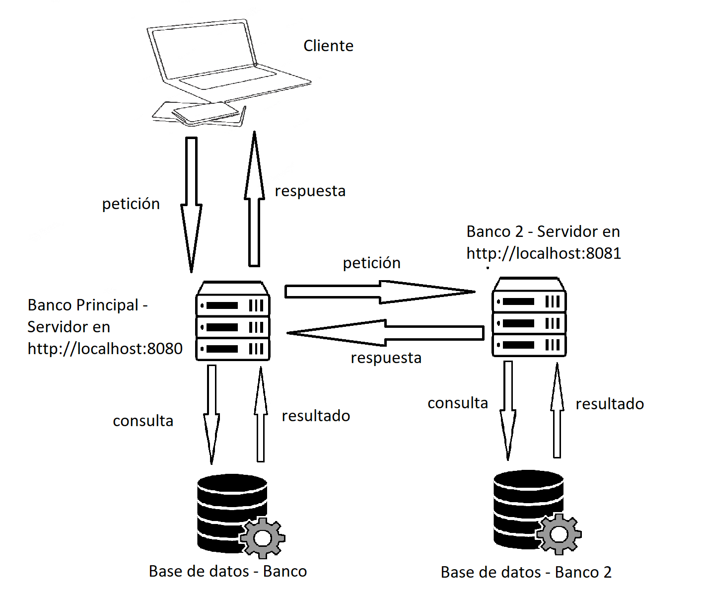

# INTRODUCCIÓN
Todo: Backend del proyecto de Sistema Bancario 2

# CÓMO EMPEZAR
Para empezar deberá clonar el repositorio con el siguiente comando:
> git clone https://github.com/hashidk/Backend-banco.git

Luego deberá dirigirse a la nueva carpeta generada con el comando:
> cd Backend-banco

El proyecto usa como base [NojeJS](https://nodejs.org/es/), por lo tanto para iniciar el servidor deberá descargarlo e instalarlo, puede hacerlo a través del siguiente enlace: https://nodejs.org/es/.

Para descargar todas las librerías necesarias para el proyecto use el comando:
> npm install

Y automáticamente se descargarán, para iniciar el servidor use el comando:
> npm start -- -default

O en el caso de querer iniciar el servidor en modo desarrollador (para este caso se hace el uso de nodemon que permite actualizar el servidor cada que se realice un cambio) use el siguiente comando:
> npm run dev -- -default

Se usa el parámetro -default para usar la configuración por defecto y los dos guiones anteriores (--) para añadir parámetros luego de los comandos, sin estos no se detectarán los parámetrnpos.

El sistema sigue la siguiente arquitectura:

Por lo tanto, para la demostración de las transferencias entre cuentas de distintos bancos, una vez el proyecto esté levantado y listo (puede probarlo), se recomienda copiar la carpeta base (que se generó al ejecutar el comando *git clone*) y ejecutando en cada carpeta el siguiente comando:
> npm start -- -p=8080 -dbname=Banco

y para la copia que se realizó (otro servidor creado) el siguiente comando:
> npm start -- -p=8081 -dbname=Banco2

El proyecto incluye internamente en la carpeta /public el frontend traspilado (HTML, CSS y Javascript puro), pero si desea ejecutar el frontend a partir de Angular, use el siguiente repositorio a la par: https://github.com/Mayra025/Software_Banco.git, tenga en cuenta que el frontend está redireccionado únicamente para el servidor con el puerto 8080, así que si levanta el segundo servidor funcionará directamente con el primero y no con el segundo servidor.

La dirección por defecto para el servidor es: 
> http://localhost:8080 

y para el [repositorio](https://github.com/Mayra025/Software_Banco.git) funcionando con Angular con la dirección: 
> http://localhost:4200.

### Credenciales del administrador:

Nombre de Usuario: 1777856465

Contraseña: CIdhxRzakZrjEOsu
